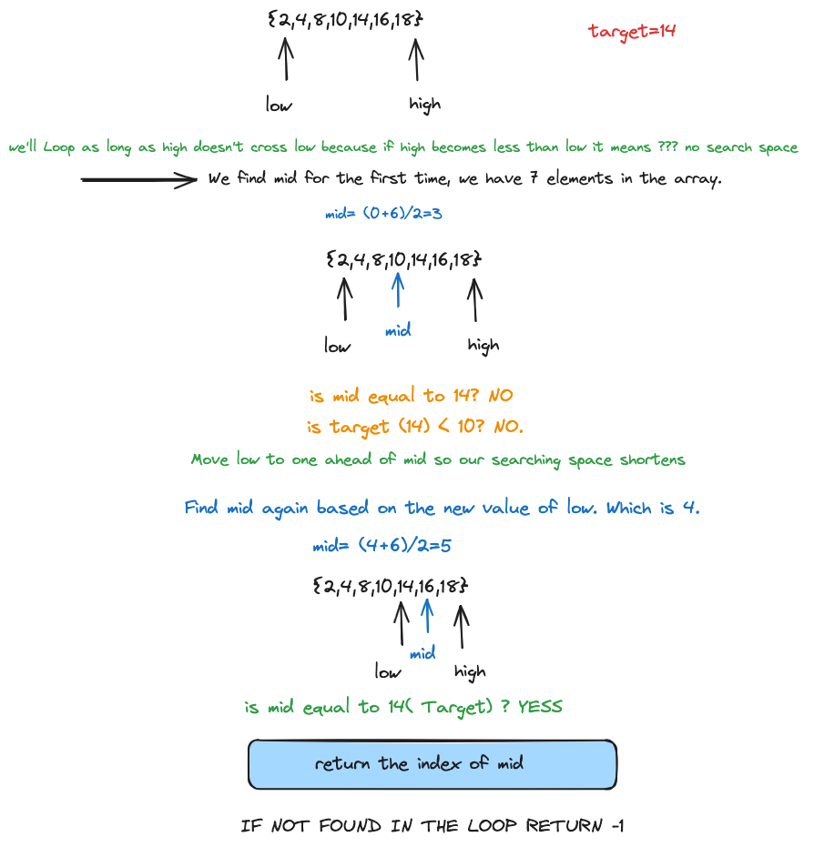

# Data Structures and Algorithms

## Binary Search

Binary search is an efficient algorithm for finding an item from a `SORTED` list of items. It works by repeatedly dividing in half the portion of the list that could contain the item, until you've narrowed down the possible locations to just one. Hence, making it very efficient.

### Complexity

- **Time Complexity**: O(log(N)), where N is the number of elements in the array.
- **Space Complexity**: O(1)

### Working

1. **Initialize**:
   - Set two pointers, `low` and `high`, to the beginning and end of the array respectively.
2. **Iterate**:
   - While `low` is less than or equal to `high`:
     - Calculate the middle index `mid` as `mid = low + (high - low) / 2`.
     - If the middle element `nums[mid]` is equal to the target, return `mid`.
     - If the target is less than `nums[mid]`, set `high` to `mid - 1`.
     - If the target is greater than `nums[mid]`, set `low` to `mid + 1`.
3. **Return**:
   - If the element is not found, return `-1`.

### Example Solved Solution

You can find implementation of the Binary Search Algorithm in the following GitHub links:

- [Binary Search (Iterative)](https://github.com/airejtashfeen/DSA/blob/master/binarysearchiterative.cpp)

- [Binary Search (Recursive)](https://github.com/airejtashfeen/DSA/blob/master/binarysearchrecursive.cpp)

BOTH OF THESE CAN BE APPLIED TO LEETCODE PROBLEM # 704
