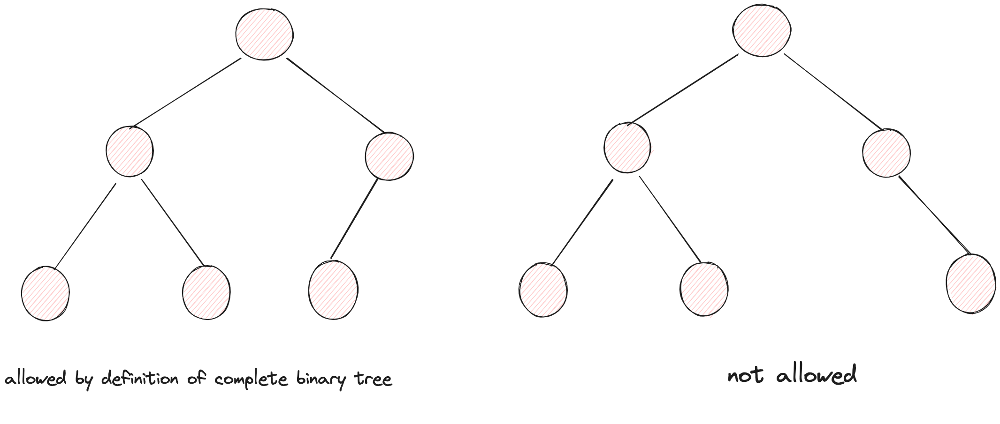
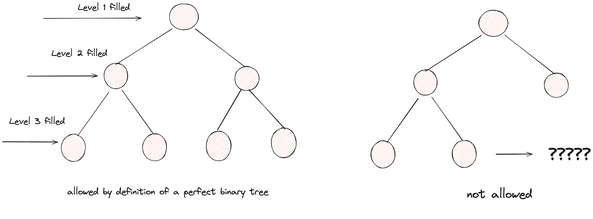
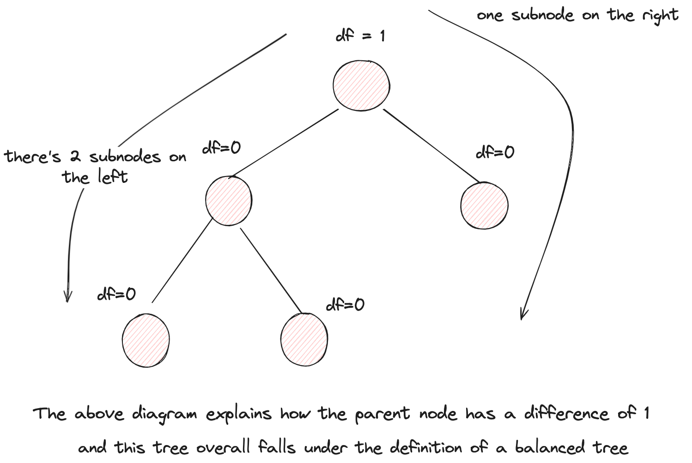
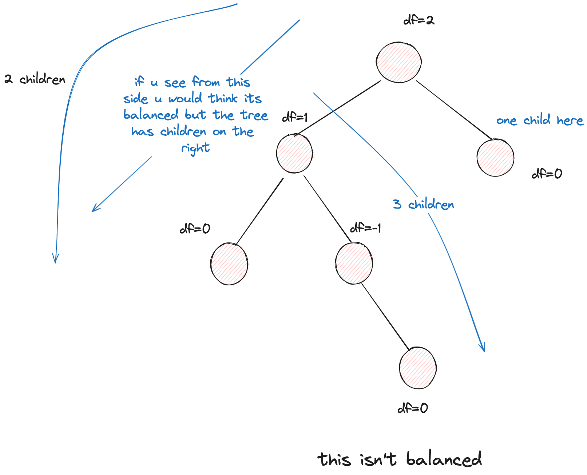

# Data Structures and Algorithms

## Binary Trees

A binary tree is one which has 0, 1, or 2 children.

### Types of Nodes

- **0 children**: Leaf node
- **1 child**: Either left child or right child, but not both
- **2 children**: Both left and right children present

### Types of Binary Trees

#### Full Binary Tree

Every node has either 0 or 2 children.

#### Complete Binary Tree

All levels are completely filled, except (possibly) for the last level.

The last level has all nodes filled from left to right, which means it can't have a node skipped from left.

#### Perfect Binary Tree

All leaf nodes are at the same level.

#### Balanced Binary Tree

A bit tricky this one, the tree should have a height difference of max 1. The height differece means the left and right subtree's difference this is well demonstrated by the diagrams below.

Think of it from the computer's POV. for eg. you have 2 folders in a directory. If one of the folder has 5 files, the other has 3. The difference would be what? it would be 2. Hence not allowed. 

