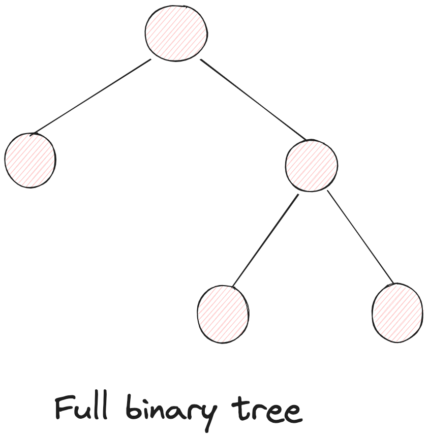

# Data Structures and Algorithms

## Binary Trees

A binary tree is one which has 0, 1, or 2 children.

### Types of Nodes

- **0 children**: Leaf node
- **1 child**: Either left child or right child, but not both
- **2 children**: Both left and right children present

### Types of Binary Trees

#### Full Binary Tree

Every node has either 0 or 2 children.

