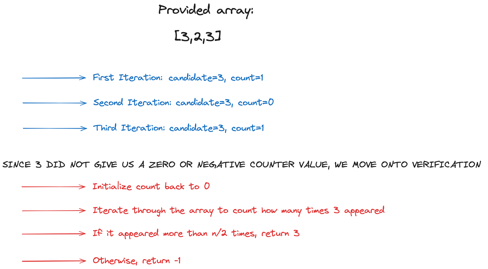

# Data Structures and Algorithms

## Boyer-Moore Majority Voting Algorithm

Boyer-Moore Voting Algorithm is a very efficient algorithm to find the majority element in an array, which is also commonly asked in Leetcode questions.

### Complexity
- **Time Complexity**: O(N), where N is the number of elements in the array.
- **Space Complexity**: O(1)

### Working

The algorithm involves two phases: candidate selection and verification.

#### Selection Phase:
1. Initialize `count` to 0 and `candidate` to any value.
2. Iterate through the array. For each element:
   - If `count` is 0, set `candidate` to the current element and set `count` to 1.
   - If the current element is equal to `candidate`, increment `count`.
   - If the current element is different from `candidate`, decrement `count`.

#### Verification Phase:
1. Initialize `count` to 0.
2. Iterate through the array again and count the occurrences of `candidate`.
3. If `candidate` appears more than ⌊n/2⌋ times, return `candidate`.
4. Otherwise, return -1.

### Example Solved Problem Solutions

You can find implementations of the Boyer-Moore Majority Voting Algorithm for specific Leetcode problems in the following GitHub links:

- [Majority Element (Leetcode)](https://github.com/airejtashfeen/Leetcode/blob/master/majorityelement.cpp)
- [Majority Element II (Leetcode)](https://github.com/airejtashfeen/Leetcode/blob/master/majorityelementii.cpp)

