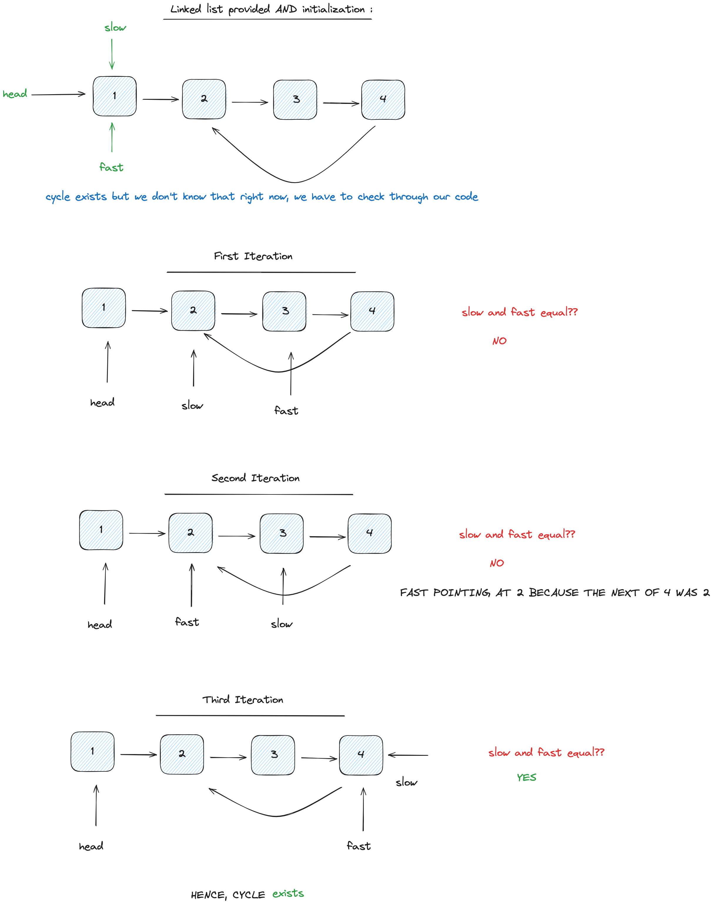

# Data Structures and Algorithms

## Floyd's Cycle Finding Algorithm 

Floyd's Cycle Finding Algorithm (also called the `Hare and Tortoise` algorithm) is an algorithm used to find a loop/cycle in a linked list. It uses `two` pointers which move through the linked list and they both move at different speeds. One is called the `fast` pointer and the other is called the `slow` pointer.

### Complexity
- **Time Complexity**: O(N), where N is the number of nodes in the linked list.
- **Space Complexity**: O(1)

### Working

Move the slow pointer by one position and the fast pointer by two positions. If they both meet at some point, then a loop exists otherwise the fast pointer would reach the end position and no cycle/loop would exist.

### Example solved question solution

- [Linked List Cycle (Leetcode)](https://github.com/airejtashfeen/Leetcode/blob/master/linked-list-cycle.cpp)

### Visual representation

