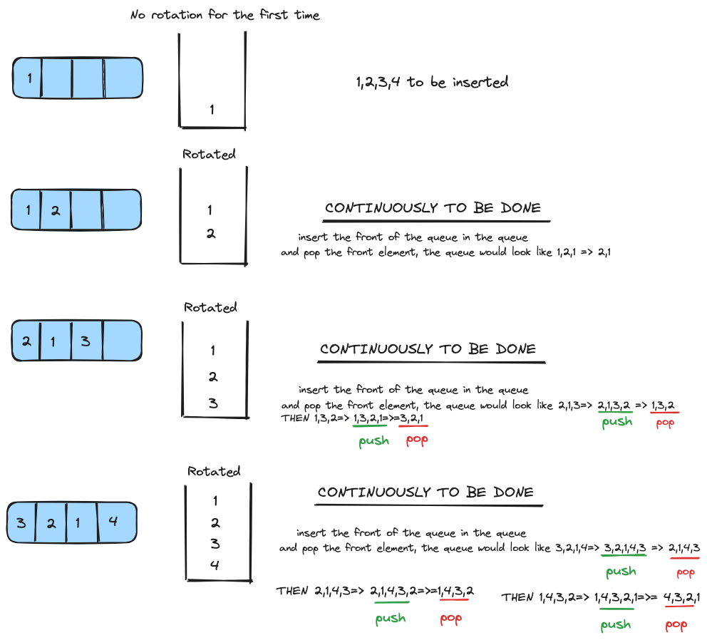

# Data Structures and Algorithms

## Implementing a Stack Using a Single Queue

## Introduction
In this note, we will explore how to implement a stack using a single queue. A stack follows Last-In-First-Out (LIFO) order, whereas a queue follows First-In-First-Out (FIFO) order. By manipulating the order of elements in the queue, we can simulate stack behavior.

## Implementation

### Key Idea
To simulate a stack using a single queue, we need to ensure that the most recently added element is always at the front of the queue. This can be achieved by rotating the elements in the queue after each push operation.

### Detailed Steps

1. **Push Operation**:
   - Add the new element to the back of the queue.
   - Rotate the queue such that the new element moves to the front.
   
2. **Pop Operation**:
   - Remove and return the front element of the queue, which represents the top of the stack.
   
3. **Top Operation**:
   - Return the front element of the queue without removing it, representing the top of the stack.
   
4. **Empty Operation**:
   - Check if the queue is empty.

### Example Solved Solution

You can find implementation of Stack using Queue in the following GitHub links:

- [Stack using Queue ](https://github.com/airejtashfeen/DSA/blob/master/stackusingqueue.cpp)